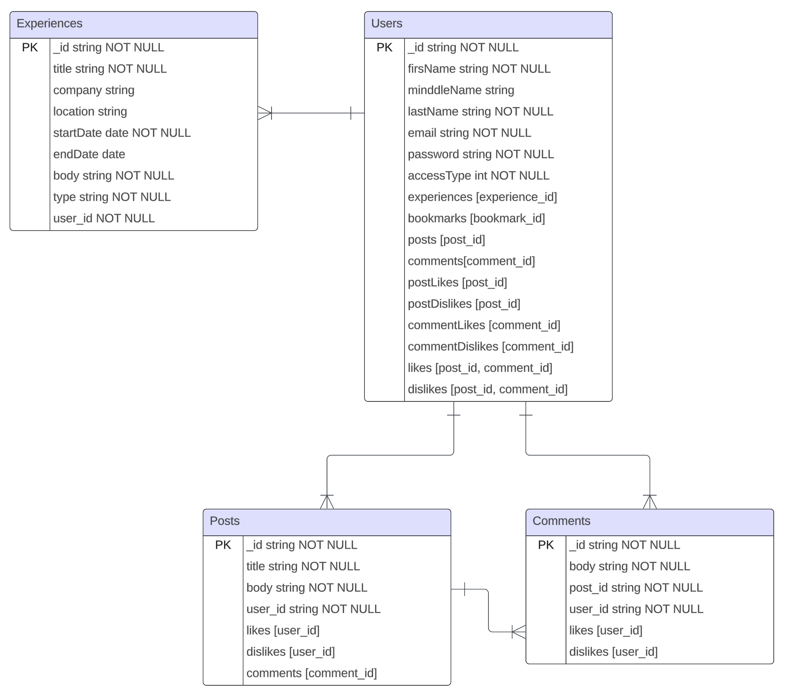

# Backend Information

## Entity Relationship Diagram (ERD)



## API Calls

### User is created
```
/users/createOne
```

### Experience is created 
```
/experiences/createOne
/users/addExperience/:user_id/:experience_id
```

### Experience is deleted 
```
/experiences/deleteOne
/users/removeExperience/:user_id/:experience_id
```

### Post is created 
```
/posts/createOne
/users/addPost/:user_id/:post_id
```

### Post is deleted 
```
/posts/deleteOne
/users/removePost/:user_id/:post_id
```

### Comment is created 
```
/comments/createOne
/users/addComment/:user_id/:comment_id
/posts/addComment/:post_id/:comment_id
```

### Comment is deleted 
```
/comments/deleteOne
/users/removeComment/:user_id/:comment_id
/posts/removeComment/:post_id/:comment_id
```

### Like is added to post 
```
/users/addPostLike/:user_id/:post_id
/posts/addLike/:post_id/:user_id
```

### Like is added to comment
```
/users/addCommentLike/:user_id/:comment_id
/comments/addLike/:comment_id/:user_id
```

### Dislike is added to post 
```
/users/addPostDislike/:user_id/:post_id
/posts/addDislike/:post_id/:user_id
```

### Dislike is added to comment
```
/users/addCommentDislike/:user_id/:comment_id
/comments/addDislike/:comment_id/:user_id
```

### Like is removed from post 
```
/users/removePostLike/:user_id/:post_id
/posts/removeLike/:post_id/:user_id
```

### Like is removed from comment
```
/users/removeCommentLike/:user_id/:comment_id
/comments/removeLike/:comment_id/:user_id
```

### Dislike is removed from post 
```
/users/removePostDislike/:user_id/:post_id
/posts/removeDislike/:post_id/:user_id
```

### Dislike is removed from comment
```
/users/removeCommentDislike/:user_id/:comment_id
/comments/removeDislike/:comment_id/:user_id
```

### Post is bookmarked
```
/users/addBookmark/:user_id/:post_id
```

### Post is unbookmarked
```
/users/removeBookmark/:user_id/:post_id
```